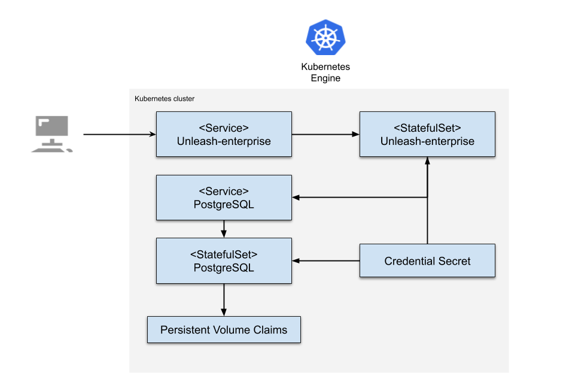

# Overview

Unleash-entprise is an enterprise feature flag servce. It adds additional funcationality 
on top of the open source edition of Unleash. Unleash gives you a great overview of all feature toggles across all your applications and services. It comes with official client implementations for Java, Node.js, Go, Ruby, Python and .Net.

For more information on Unleash, see the [Unleash-hosted website](https://www.unleash-hosted.com/).

## Design



The Unleash application contains:

- An Application resource, which collects all the deployment resources into one logical entity
- A ServiceAccount for the Unleash and PostgreSQL Pod.
- A Secret with the PostgreSQL initial random password
- A StatefulSet with Unleash and PostgreSQL.
- A PersistentVolume and PersistentVolumeClaim for Unleash and PostgreSQL. Note that these resources won't be deleted when you delete the application. If you delete the installation and recreate it with the same name, the new installation uses the same PersistentVolumes. As a result, there is no new database initialization, and no new password is set.
- A Service, which exposes PostgreSQL and Unleash to usage in cluster

PostgreSQL exposes a clusterIP that makes it available for Unleash within the cluster network.
Unleash exposes a clusterIP that makes it available within the network. The steps to connect to your Unleash application are described later in this readme.
All the data and extensions of Unleash and PostgreSQL are stored on the PersistentVolumeClaim.

# Installation

## Quick install with Google Cloud Marketplace

Get up and running with a few clicks! Install this Unleash application to a Google Kubernetes Engine cluster using Google Cloud Marketplace. Follow the
[on-screen instructions](https://console.cloud.google.com/marketplace/details/bricks-software/unleash-enterprise).

## Command line instructions

You can use [Google Cloud Shell](https://cloud.google.com/shell/) or a local workstation to complete these steps.

[](https://console.cloud.google.com/cloudshell/editor?cloudshell_git_repo=https://github.com/unleash-hosted/unleash-hosted-gcp-marketplace&cloudshell_working_dir=/)

### Prerequisites

#### Set up command line tools

You'll need the following tools in your environment. If you are using Cloud Shell, these tools are installed in your environment by default.

- [gcloud](https://cloud.google.com/sdk/gcloud/)
- [kubectl](https://kubernetes.io/docs/tasks/tools/install-kubectl/)
- [docker](https://docs.docker.com/install/)
- [openssl](https://www.openssl.org/)
- [helm](https://helm.sh/docs/using_helm/#installing-helm)
- [git](https://git-scm.com/book/en/v2/Getting-Started-Installing-Git)

Configure `gcloud` as a Docker credential helper:
```shell
gcloud auth configure-docker
```

#### Create a Google Kubernetes Engine cluster

Create a cluster from the command line. If you already have a cluster that
you want to use, this step is optional.

```shell
export CLUSTER=unleash-cluster
export ZONE=europe-west1-c

gcloud container clusters create "$CLUSTER" --zone "$ZONE"
```

#### Configure kubectl to connect to the cluster

```shell
gcloud container clusters get-credentials "$CLUSTER" --zone "$ZONE"
```

#### Clone this repo

Clone this repo and the associated tools repo:

```shell
git clone --recursive https://github.com/unleash-hosted/unleash-hosted-gcp-marketplace
```

#### Install the Application resource definition

An Application resource is a collection of individual Kubernetes components,
such as Services, Deployments, and so on, that you can manage as a group.

To set up your cluster to understand Application resources, run the following command:

```shell
kubectl apply -f "https://raw.githubusercontent.com/GoogleCloudPlatform/marketplace-k8s-app-tools/master/crd/app-crd.yaml"
```

You need to run this command once for each cluster.

The Application resource is defined by the
[Kubernetes SIG-apps](https://github.com/kubernetes/community/tree/master/sig-apps) community. The source code can be found on
[github.com/kubernetes-sigs/application](https://github.com/kubernetes-sigs/application).

### Install the application


#### Configure the application with environment variables

Choose an instance name and
[namespace](https://kubernetes.io/docs/concepts/overview/working-with-objects/namespaces/)
for the application. In most cases, you can use the `default` namespace.

```shell
export APP_INSTANCE_NAME=unleash-1
export NAMESPACE=default
```

Set up the image tag:

It is advised to use stable image reference which you can find on
[Marketplace Container Registry](https://marketplace.gcr.io/bricks-software/unleash-enterprise).
Example:

```shell
export TAG="3.2.30"
```

Alternatively you can use short tag which points to the latest image for selected version.
> Warning: this tag is not stable and referenced image might change over time.

```shell
export TAG="3"
```

Configure the container images:

```shell
export IMAGE_UNLEASH="gcr.io/bricks-software-public/unleash-enterprise"
export IMAGE_POSTGRESQL="gcr.io/bricks-software-public/unleash-enterprise/postgresql:latest"
export IMAGE_METRICS_EXPORTER="gcr.io/bricks-software-public/unleash-enterprise/prometheus-to-sd:latest"
```

Generate random password for PostgreSQL:

```shell
export POSTGRESQL_DB_PASSWORD=$(openssl rand 9 | openssl base64 -A | openssl base64)
```

Enable Stackdriver Metrics Exporter:

> **NOTE:** Your GCP project should have Stackdriver enabled. For non-GCP clusters, export of metrics to Stackdriver is not supported yet.

By default the integration is disabled. To enable, change the value to `true`.

```shell
export METRICS_EXPORTER_ENABLED=false
```

#### Expand the manifest template

Use `helm template` to expand the template. We recommend that you save the
expanded manifest file for future updates to the application.

```shell
helm template "$APP_INSTANCE_NAME" chart/unleash-enterprise \
  --namespace "$NAMESPACE" \
  --set unleash.image.repo="$IMAGE_UNLEASH" \
  --set unleash.image.tag="$TAG" \
  --set postgresql.image="$IMAGE_POSTGRESQL" \
  --set postgresql.db.password="$POSTGRESQL_DB_PASSWORD" \
  --set metrics.image="$IMAGE_METRICS_EXPORTER" \
  --set metrics.exporter.enabled="$METRICS_EXPORTER_ENABLED" \
  > "${APP_INSTANCE_NAME}_manifest.yaml"
```

#### Apply the manifest to your Kubernetes cluster

Use `kubectl` to apply the manifest to your Kubernetes cluster:

```shell
kubectl apply -f "${APP_INSTANCE_NAME}_manifest.yaml" --namespace "${NAMESPACE}"
```

#### View the app in the Google Cloud Console

To get the GCP Console URL for your app, run the following command:

```shell
echo "https://console.cloud.google.com/kubernetes/application/${ZONE}/${CLUSTER}/${NAMESPACE}/${APP_INSTANCE_NAME}"
```

To view the app, open the URL in your browser.

# Using Unleash-enterprise

By default, the application is not exposed externally. To get access to Unleash UI, run the following command:

```bash
kubectl port-forward --namespace $NAMESPACE svc/$APP_INSTANCE_NAME-unleash-enterprise-svc 4242:4242
```

Then, open [http://localhost:4242/](http://localhost:4242/).

# Application metrics


## Unleash metrics

The application is configured to expose its metrics using the
[Prometheus format](https://github.com/prometheus/docs/blob/master/content/docs/instrumenting/exposition_formats.md).

You can access the metrics at `[UNLEASH_CLUSTER_IP]:4242/internal-backstage/prometheus`, where
`[UNLEASH_CLUSTER_IP]` is the IP address of the application on Kubernetes
cluster.

### Configuring Prometheus to collect metrics

Prometheus can be configured to automatically collect the application's metrics.
Follow the steps in
[Configuring Prometheus](https://prometheus.io/docs/introduction/first_steps/#configuring-prometheus).

You configure the metrics in the
[`scrape_configs` section](https://prometheus.io/docs/prometheus/latest/configuration/configuration/#scrape_config).

## Exporting metrics to Stackdriver

The deployment includes a
[Prometheus to Stackdriver (`prometheus-to-sd`)](https://github.com/GoogleCloudPlatform/k8s-stackdriver/tree/master/prometheus-to-sd)
container. If you enabled the option to export metrics to Stackdriver, the
metrics are automatically exported to Stackdriver and visible in
[Stackdriver Metrics Explorer](https://cloud.google.com/monitoring/charts/metrics-explorer).
The name of each metric starts with the application's name, which you define in
the `APP_INSTANCE_NAME` environment variable.

The export option might not be available for GKE On-prem clusters.

> Note: Stackdriver has [quotas](https://cloud.google.com/monitoring/quotas) for
> the number of custom metrics created in a single GCP project. If the quota is
> met, additional metrics might not show up in the Stackdriver Metrics Explorer.

You can remove existing metric descriptors using
[Stackdriver's REST API](https://cloud.google.com/monitoring/api/ref_v3/rest/v3/projects.metricDescriptors/delete).

# Scaling

Unleash-enterprise artifact is a stateless deploment, you may increse the number of replicas to handle more load.

```shell
kubectl scale deployment.v1.apps/$APP_INSTANCE_NAME-unleash-enterprise --replicas=3
```

# Backup and restore

There are 2 core components in the Unleash-enterprise platform:
- Unleash-enterpruie Server, which containts these parts
  - A web server for the Uneash UI, where you configure your feature toggles
  - A api used by application to query feature toogle configuration
- The Unleash database

To back up the application, you must back up the database.


## Backing up PostgreSQL

Your Unleash-enterprise configuration and project data is stored in the PostgreSQL database.
The following script creates a `postgresql/backup.sql` file with the contents of the database.

```shell
mkdir postgresql
kubectl --namespace $NAMESPACE exec -t \
	$(kubectl -n$NAMESPACE get pod -oname | \
		sed -n /\\/$APP_INSTANCE_NAME-postgresql/s.pods\\?/..p) \
	-c postgresql-server \
	-- pg_dumpall -c -U postgres > postgresql/backup.sql
```

## Backup your database password

Use this command to see a base64-encoded version of your PostgreSQL password:

```shell
kubectl get secret $APP_INSTANCE_NAME-secret --namespace $NAMESPACE -o yaml | grep password:
```

## Restoring the database

### Enter maintenance mode

Before you restore the PostgreSQL database, we recommend closing all incoming connections to the database.

1. The following command blocks incoming database connections:

    ```shell
    kubectl --namespace $NAMESPACE exec -t \
      $(kubectl -n$NAMESPACE get pod -oname | \
         sed -n /\\/$APP_INSTANCE_NAME-postgresql/s.pods\\?/..p) \
      -c postgresql-server \
      -- psql -U postgres -c "update pg_database set datallowconn = false where datname = 'unleash';"
    ```

1. To ensure data consistency, use this command to drop all active connections:

    ```shell
    kubectl --namespace $NAMESPACE exec -t \
      $(kubectl -n$NAMESPACE get pod -oname | \
         sed -n /\\/$APP_INSTANCE_NAME-postgresql/s.pods\\?/..p) \
      -c postgresql-server \
      -- psql -U postgres -c "select pg_terminate_backend(pid) from pg_stat_activity where datname='unleash';"
    ```
### Restore the database

1. Use this command to restore your data from `postgresql/backup.sql`:

    ```shell
    cat postgresql/backup.sql | kubectl --namespace $NAMESPACE exec -i \
      $(kubectl -n$NAMESPACE get pod -oname | \
        sed -n /\\/$APP_INSTANCE_NAME-postgresql/s.pods\\?/..p) \
      -c postgresql-server \
      -- psql -U postgres
    ```

1. Use the following command to copy data files from your local folder to `$UNLEASH_HOME/data` in the Unleash-enterprise Pod:

    ```shell
    kubectl --namespace $NAMESPACE cp data $(kubectl -n$NAMESPACE get pod -oname | \
      sed -n /\\/$APP_INSTANCE_NAME-unleash/s.pods\\?/..p):/opt/unleash/data
    ```

1. Delete the unneeded Unleash application data:

    ```shell
    kubectl --namespace $NAMESPACE exec -i \
      $(kubectl -n$NAMESPACE get pod -oname | \
        sed -n /\\/$APP_INSTANCE_NAME-unleash/s.pods\\?/..p) \
      -- bash -c "rm -rf /opt/unleash/data/es5/* "
    ```

1. Enable incoming connections for the `unleash` database schema:

    ```shell
    kubectl --namespace $NAMESPACE exec -t \
      $(kubectl -n$NAMESPACE get pod -oname | \
        sed -n /\\/$APP_INSTANCE_NAME-postgresql/s.pods\\?/..p) \
      -c postgresql-server \
      -- psql -U postgres -c "update pg_database set datallowconn = true where datname = 'unleash';"
    ```

1. Patch a Secret to restore your database password:

   ```shell
   kubectl --namespace $NAMESPACE patch secret unleash-1-secret -p '{"data": {"password": "'"$ENCODED_PASS"'"}}'
   ```

   where `$ENCODED_PASS` is variable with the base64-encoded password that you backed up.

1. Finally, restart the Unleash Pod:

    ```shell
    kubectl --namespace $NAMESPACE  exec -i $(kubectl -n$NAMESPACE get pod -oname | \
      sed -n /\\/$APP_INSTANCE_NAME-unleash/s.pods\\?/..p) \
      -- bash -c "kill -1 1"
    ```

# Uninstalling the Application

## Using the Google Cloud Platform Console

1. In the GCP Console, open [Kubernetes Applications](https://console.cloud.google.com/kubernetes/application).

1. From the list of applications, click **unleash-1**.

1. On the Application Details page, click **Delete**.

## Using the command line

### Prepare the environment

Set your installation name and Kubernetes namespace:

```shell
export APP_INSTANCE_NAME=unleash-1
export NAMESPACE=default
```

### Delete the resources

> **NOTE:** We recommend to use a `kubectl` version that is the same as the version of your cluster. Using the same versions of `kubectl` and the cluster helps avoid unforeseen issues.

To delete the resources, use the expanded manifest file used for the
installation.

Run `kubectl` on the expanded manifest file:

```shell
kubectl delete -f ${APP_INSTANCE_NAME}_manifest.yaml --namespace $NAMESPACE
```

Otherwise, delete the resources using types and a label:

```shell
kubectl delete application,statefulset,service,pvc,secret \
  --namespace $NAMESPACE \
  --selector app.kubernetes.io/name=$APP_INSTANCE_NAME
```

### Delete the persistent volumes of your installation

By design, the removal of StatefulSets in Kubernetes does not remove
PersistentVolumeClaims that were attached to their Pods. This prevents your
installations from accidentally deleting stateful data.

To remove the PersistentVolumeClaims with their attached persistent disks, run
the following `kubectl` commands:

```shell
for pv in $(kubectl get pvc --namespace $NAMESPACE \
  --selector app.kubernetes.io/name=$APP_INSTANCE_NAME \
  --output jsonpath='{.items[*].spec.volumeName}');
do
  kubectl delete pv/$pv --namespace $NAMESPACE
done

kubectl delete persistentvolumeclaims \
  --namespace $NAMESPACE \
  --selector app.kubernetes.io/name=$APP_INSTANCE_NAME
```

### Delete the GKE cluster

Optionally, if you don't need the deployed application or the GKE cluster,
delete the cluster using this command:

```
gcloud container clusters delete "$CLUSTER" --zone "$ZONE"
```

